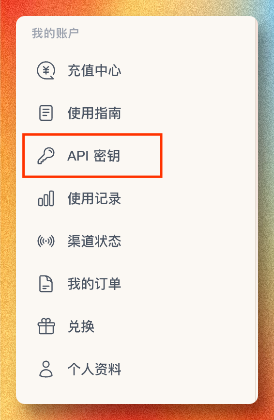
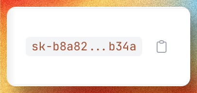
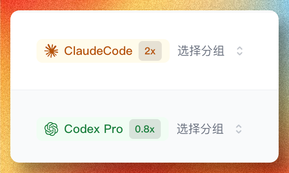

# 创建 API Key

`API` 可以先理解成“工具和模型说话的通道”。

你平时和 AI 聊天，是打开网页，在输入框里打字。`Codex`、`Claude Code`、`Skills` 这些工具不会像人一样点网页，它们需要用软件之间的方式去请求模型，这种方式就叫 API。

`API Key` 是这条通道上的钥匙，用来证明这是你的 SorryCode 账号在使用模型。它通常长这样：`sk-...`。

无论你后面走 Codex、Claude Code、CC-Switch、图片 Skill，还是手动请求，这一步都绕不开。现在的一键安装也会在流程里要求你输入 API Key，所以最好先在控制台把它准备好。

一份 SorryCode 余额可以对应多把 API Key。新手不要把所有工具都挤在同一把 key 里。

如果你同时想用 Codex 和 Claude Code，建议创建两把：

```text
Codex 用一把
Claude Code 用一把
```

余额仍然是同一份。分开创建，是为了之后看使用记录、切换分组、设置限额和排查问题更省心。

## 最短路径

1. 打开 `https://sorrycode.com/login` 登录 SorryCode 控制台
2. 在左侧菜单找到 `API 密钥`
3. 点击创建密钥
4. 名称写清楚用途，例如 `Codex`、`Claude Code`、`Image Skill`
5. 选择分组
6. 创建后复制密钥，并安全保存

你最后拿到的，应该是一个 `sk-...`。

快速入口是：

`https://sorrycode.com/keys`

但不要只记这个地址。更重要的是记住它在控制台里的位置，因为很多小白第一次进去时，根本不知道自己应该点哪里。



## 创建时怎么填

名称只给你自己看。建议直接写用途：

```text
Codex
Claude Code
图片 Skill
测试请求
```

分组决定这把 key 走哪组模型和计费倍率。创建后也可以回到 API 密钥列表里切换分组。

额度限制是这把 key 最多可以消耗多少余额。`0` 表示不单独限制。新手可以先不设置，等开始稳定使用后，再给不同 key 设上限。

速率限制是请求频率限制，不是模型倍率。如果你只是正常使用 Codex 或 Claude Code，通常不用先开。

密钥有效期适合临时测试 key。长期使用的 Codex / Claude Code key，一般不用先设置有效期。


## 你真正要记住什么

小白先记住三句话：

- `API` 是通道
- `API Key` 是钥匙
- `SorryCode` 是创建钥匙、管理额度、把工具接到模型上的地方

再记住一件事：

```text
一份余额，可以有多把 API Key。
```

你可以给不同工具分别创建 key。比如 Codex 一把，Claude Code 一把，图片 Skill 一把。它们消耗的是同一份余额，但记录、分组和限额可以分开管理。

如果你走的是一键安装，安装器会帮你写入大部分配置，你通常不需要先理解 `Base URL`。

只有手动配置时，才需要继续看下面两个值：

- API Key：你刚创建出来的 `sk-...`
- 你要接的工作台走哪种 Base URL

如果你走的是 `Codex` 这类 OpenAI-compatible 路径，用的是：

- `{{API_BASE_URL}}`

如果你走的是 `Claude Code` 这类 Anthropic-compatible 路径，用的是：

- `{{ANTHROPIC_BASE_URL}}`

有些 runtime 的字段名看起来不像 API Key，不要被名字带偏。

比如在 `Claude Code` 里，字段名叫 `ANTHROPIC_AUTH_TOKEN`，但里面填的仍然是同一个 `sk-...`。

## 创建后怎么用

创建完成后，控制台会显示完整密钥。复制这段 `sk-...`。



如果你走 Codex 或 Claude Code 的一键安装，安装器会停下来让你粘贴 API Key。把刚复制的 `sk-...` 粘贴进去即可。

如果你已经创建过 key，也可以在 API 密钥列表里：

- 复制密钥
- 修改名称
- 切换分组
- 设置额度限制
- 禁用或删除不再使用的 key

不要把不同工具混在一把 key 里硬撑。分开创建，后面看记录会轻松很多。



## 安全要求

- 不要提交到代码仓库
- 不要发到公共群
- 不要直接写进长期可见的 shell history
- 泄露后立即废弃重建

## 下一步

- 不知道自己适不适合：去 [Platform / SorryCode 适合谁](/docs/platform/who-is-sorrycode-for)
- 想理解 AI 成本：去 [Platform / AI 成本怎么计算](/docs/platform/ai-cost-basics)
- 想直接开始用 Codex：去 [Runtime / Codex](/docs/runtime/codex)
- 想直接开始用 Claude Code：去 [Runtime / Claude Code](/docs/runtime/claude-code)
- 不清楚工具和模型关系：去 [Platform / 工具不是模型](/docs/concepts/tools-models-platform)
- 想先做最小验证：去 [Platform / 首条请求](/docs/platform/create-api-key)
- 想少碰终端：去 [工具 / CC-Switch](/docs/tools/cc-switch)
