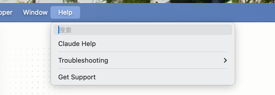
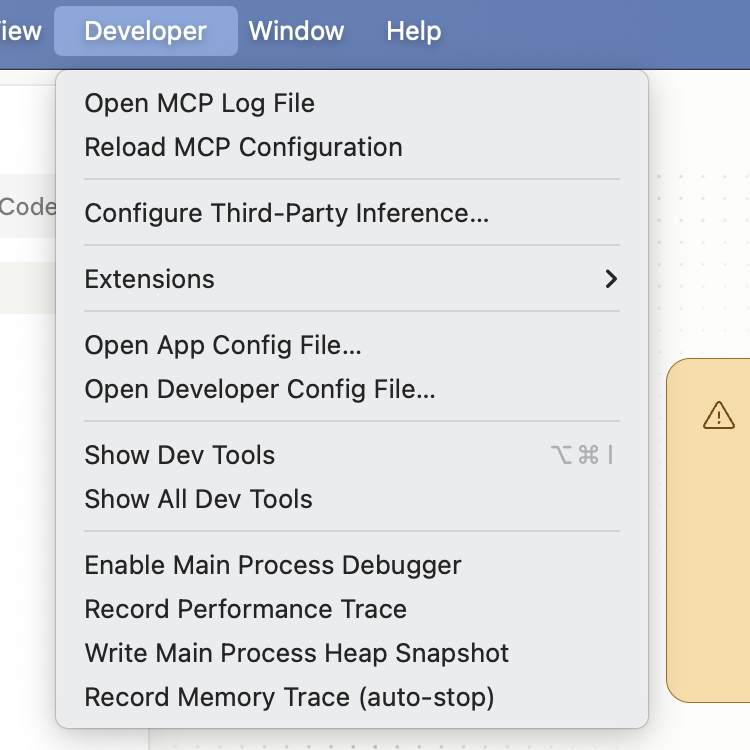
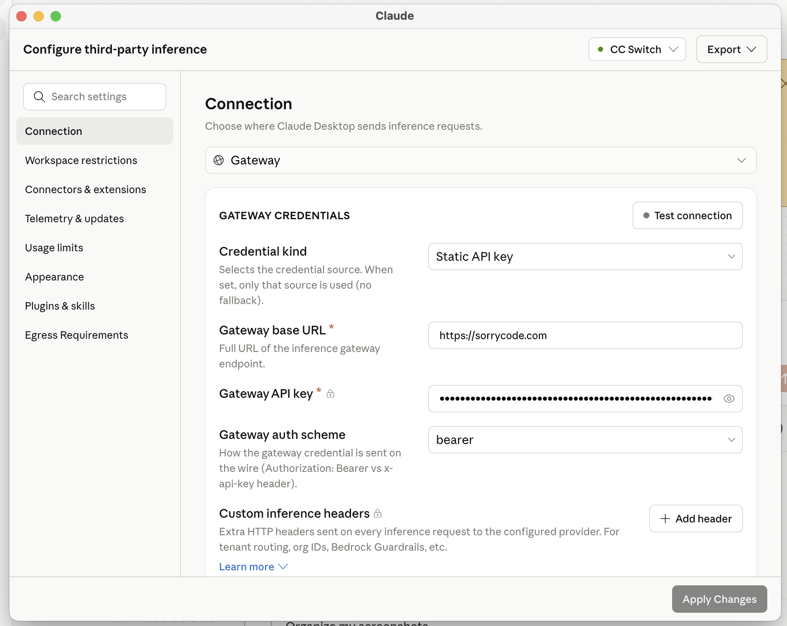
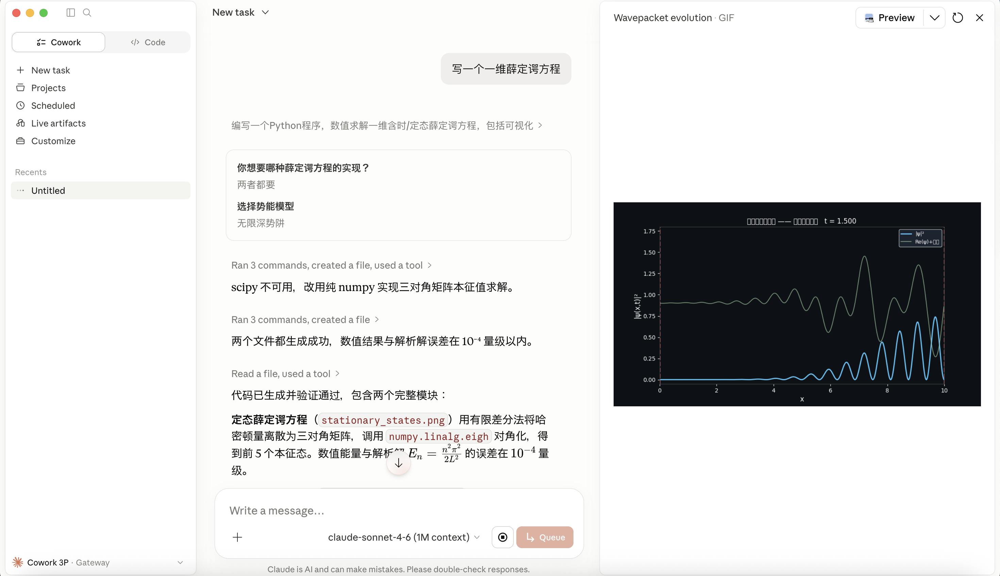

# Claude Desktop

If you want to use the graphical `Claude Desktop` app while sending model requests through SorryCode, this is the shortest path.

You do not need to learn terminal commands or edit config files first. Prepare your SorryCode API key, open the third-party inference settings in Claude Desktop, fill in the Gateway URL and key, then restart the app. When Claude Desktop opens in `Cowork 3P · Gateway`, the connection is active.

This page is about Claude Desktop's third-party inference gateway. If you want to use `claude` in a terminal to read projects, edit code, and run commands, start with [Runtime / Claude Code](/docs/runtime/claude-code).

<h2 id="prepare">Prepare First</h2>

You need three things:

1. `Claude Desktop` installed
2. a SorryCode API key
3. the SorryCode Gateway URL: `https://sorrycode.com`

Claude Desktop download:

<https://claude.com/download>

Create your API key in the SorryCode console:

<https://sorrycode.com/keys>

After creating the key, you will get an `sk-...` value. Keep it nearby for the configuration step.

If you have not created an API key yet, read [Platform / Create API Key](/docs/platform/create-api-key) first.

<h2 id="macos">macOS Setup</h2>

### Step 1: Open Claude Desktop

Open `Claude Desktop`.

If this is your first launch, staying on the sign-in screen is enough. Do not sign in with an Anthropic account yet, because this setup uses a third-party inference gateway.

### Step 2: Enable Developer Mode

Keep Claude Desktop open and look at the macOS menu bar at the top of the screen.

Click `Help` first. If developer mode is not enabled yet, you will find `Troubleshooting` here.



Click:

```text
Help → Troubleshooting → Enable Developer Mode
```

Confirm the prompt. Claude Desktop will restart, or ask you to reopen it.

If you do not see the `Developer` menu afterward, Developer Mode probably did not enable successfully. Quit Claude Desktop completely and open it again.

### Step 3: Open Third-Party Inference Settings

After restart, the top menu bar should include `Developer`.

Click:

```text
Developer → Configure Third-Party Inference...
```



This opens the third-party inference configuration window.

### Step 4: Fill In SorryCode

In the configuration window, make sure the connection type is `Gateway`.

Then fill in:

| Field | Value |
| --- | --- |
| `Credential kind` | `Static API key` |
| `Gateway base URL` | `https://sorrycode.com` |
| `Gateway API key` | your SorryCode API key, the `sk-...` value |
| `Gateway auth scheme` | `bearer` |



Notes:

- do not add extra spaces to `Gateway base URL`
- use `https://sorrycode.com` here; do not add `/v1`, `/v1/messages`, or another path
- paste the `sk-...` key you created in SorryCode
- it is normal for the API key field to display dots instead of plain text
- if you are unsure, click `Test connection` first

After filling the form, click `Apply Changes` in the lower-right corner.

That applies this configuration to the current computer.

### Step 5: Restart and Enter Gateway Mode

After applying the settings, restart Claude Desktop when prompted.

If you see `Continue with gateway` after restart, click it.

Once inside the app, the lower-left status area should show something like:

```text
Cowork 3P · Gateway
```

That means Claude Desktop is now working through the Gateway path.



<h2 id="windows">Windows Setup</h2>

The values are the same on Windows. The main difference is the menu entry.

Open Claude Desktop and stay on the sign-in page.

Find the menu button in the upper-left corner. If needed, press `Tab` until the menu is focused, then press `Enter`.

Then open:

```text
Help → Troubleshooting → Enable Developer Mode
Developer → Configure Third-Party Inference...
```

Fill in the same values:

| Field | Value |
| --- | --- |
| `Credential kind` | `Static API key` |
| `Gateway base URL` | `https://sorrycode.com` |
| `Gateway API key` | your SorryCode API key, the `sk-...` value |
| `Gateway auth scheme` | `bearer` |

Click `Apply Changes`, then restart Claude Desktop when prompted.

<h2 id="verify">Verify It Works</h2>

After setup, do not start by asking Claude to edit a project.

Ask something simple first:

```text
Can you reply normally right now?
```

If Claude replies, the basic connection is working.

If you want to check the working mode, ask:

```text
Do not change any files yet. Just tell me what this interface can do.
```

For your first run, use low-risk checks. Do not start with file deletion, large refactors, or complex command execution.

<h2 id="common-issues">Common Issues</h2>

### No Developer Menu

First confirm you have run:

```text
Help → Troubleshooting → Enable Developer Mode
```

Then quit Claude Desktop completely and open it again.

Closing the window may not fully quit the app. On macOS, use `Quit Claude` from the menu bar. On Windows, confirm the app is no longer running from the taskbar or Task Manager.

### Cannot Find Configure Third-Party Inference

Make sure Developer Mode is enabled and Claude Desktop has restarted.

If the entry is still missing, your Claude Desktop version may not support it. Update to the latest version and reopen the app.

### No Continue With Gateway

The configuration usually has not been applied successfully.

Check:

1. Did you click `Apply Changes`?
2. Did you restart Claude Desktop when prompted?
3. Are the Gateway URL and API key still present in the configuration window?

If it still does not appear, open the configuration window and save it again.

### API Key Error

Copy the API key from the SorryCode console again.

Do not include extra spaces or surrounding explanation text. The correct key usually starts with `sk-...`.

### Connection Failed

Check these first:

1. is `Gateway base URL` correct?
2. is the API key valid?
3. does the SorryCode account have available balance or permission?
4. can your current network reach SorryCode?

If you are not sure which layer failed, read [Troubleshoot / Common Errors](/docs/platform/create-api-key).

### Code View Does Not Behave As Expected

Different Claude Desktop views may have different capability boundaries. First use this page to get Gateway mode working.

If your goal is to read a local project, edit code, and run commands, the steadier default path is still [Runtime / Claude Code](/docs/runtime/claude-code).

<h2 id="next">Next Step</h2>

Once Claude Desktop opens successfully, start with a small task:

```text
Help me make a beginner AI-tool learning checklist. Keep it short and split it into today, this week, and later.
```

If you want it to inspect a local project, start with:

```text
Do not change files yet. Tell me what this project seems to do and which files I should read first.
```

Let it observe first, then act. That is the safer first run.
