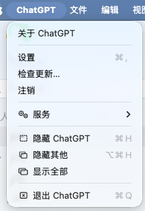
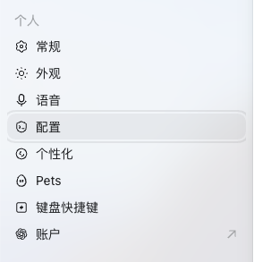
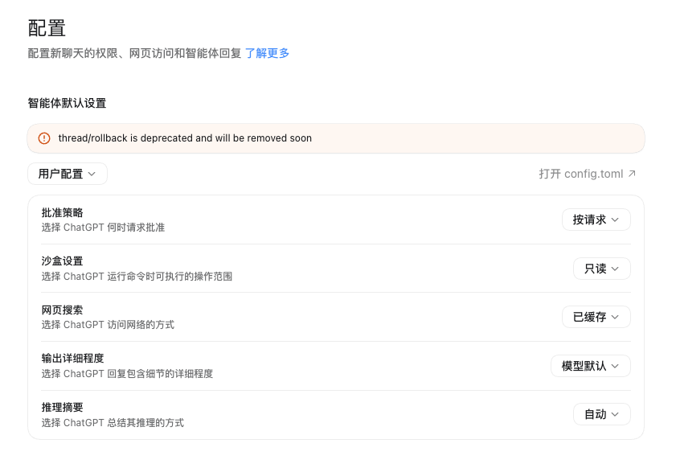

# Use Other Models in ChatGPT / Codex

The ChatGPT desktop app and Codex CLI share `~/.codex/config.toml`. Codex officially supports other models and providers that implement Responses or Chat Completions. Chat Completions support is deprecated, so SorryCode third-party models should use Responses when available.

Grok is not part of the GPT family, but it can run in the same ChatGPT / Codex workbench. `grok-4.6` passed non-streaming and streaming Responses connectivity checks through SorryCode on August 17, 2026.

> **Let Your Agent Configure It**
>
> Click `Copy Markdown` in the upper-right and send the content to the agent you are using. Ask it to complete the configuration and verification steps it can safely perform, then list anything that still needs your confirmation. If the agent can read web pages, you can send this page URL instead. Do not paste your API key into the conversation.

<h2 id="prepare">Choose the Right Key and Model</h2>

Open the [API Key page](https://sorrycode.com/keys) and choose a key whose group contains the target model. The key and model must match:

- for `grok-4.6`, use a Grok-group key that lists this model
- for DeepSeek, use a key whose group lists the target DeepSeek model
- do not use an Image2 key for Grok, and do not assume keys are interchangeable because they all start with `sk-`

If ChatGPT / Codex already uses SorryCode with a key from another group, click `Connect Tool` beside the target key, select `Codex` and your operating system, then run the generated command. The installer saves that key without requiring a public environment variable. To return to another group later, generate the connection command from that group's key again.

Use the exact model ID available to the current key. List the models first when needed:

```bash
curl https://sorrycode.com/v1/models \
  -H "Authorization: Bearer <PASTE YOUR SORRYCODE API KEY HERE>"
```

Use this command in Windows PowerShell:

```powershell
curl.exe https://sorrycode.com/v1/models -H "Authorization: Bearer <PASTE YOUR SORRYCODE API KEY HERE>"
```

Current examples for this page are:

```text
grok-4.6
deepseek-v4-flash
deepseek-v4-pro
```

A model in the list can be routed by that key. This guide verifies connectivity and the response path. It does not promise identical prompt following, tool selection, or output style across models.

<h2 id="cli">Use Grok in Codex CLI</h2>

Pass the model when Codex starts:

```bash
codex -m grok-4.6
```

Run `/status` inside the session to confirm the active model and provider. The same option works for a non-interactive task:

```bash
codex exec -m grok-4.6 "Inspect this project without making changes and identify its entry point"
```

`/model` only displays entries from the current Codex model catalog. It does not accept an arbitrary model ID. If Grok is absent from the picker, keep using `-m grok-4.6`.

For frequent use, create `~/.codex/grok.config.toml`:

```toml
model = "grok-4.6"
```

Then start Codex with:

```bash
codex --profile grok
```

This profile only changes the model. Keep the existing `model_provider`, and do not copy a provider name from another user's configuration.

DeepSeek follows the same CLI and profile rules. Replace the model ID with the exact name available to the current key.

<h2 id="app">Use Grok in the ChatGPT App</h2>

The ChatGPT App model picker may filter out third-party models. Even when `grok-4.6` works with the current key, the picker may show only GPT models or label the active model as `Custom`.

1. Choose `ChatGPT` > `Settings` from the macOS menu bar

   

2. Open `Configuration` in the left sidebar

   

3. Click `Open config.toml`

   

4. Find the top-level `model` setting
5. Record its current value and change only that setting to `grok-4.6`
6. If `model_provider` is present, leave it unchanged
7. Save the file and quit the App completely. Use `Command-Q` on macOS
8. Reopen the App and start a new task

The relevant setting should look like this:

```toml
model = "grok-4.6"
```

Edit an existing `model` value instead of adding a duplicate. Keep it at the top level, outside every `[model_providers.*]` section.

To return to GPT or another model, first make sure ChatGPT / Codex holds a key for that model's group. Restore the previous `model`, quit the App completely, and reopen it. Existing tasks can retain their previous model, so verify with a new task.

If the App shows `Custom`, do not ask the model to identify itself. Check the actual model ID in your SorryCode usage records.

<h2 id="related">Other Grok Capabilities</h2>

This page only covers Grok text models in ChatGPT / Codex. The other entry points are maintained separately:

- xAI's own terminal workbench: [Grok Build](/docs/runtime/grok-build)
- image API: [Grok Image Generation](/docs/runtime/grok-image)
- video jobs and polling: [Grok Video Generation](/docs/runtime/grok-video)

<h2 id="troubleshoot">A Model Does Not Work</h2>

- `401`: confirm that ChatGPT / Codex currently holds the complete key for the target group
- `404` or model not found: query `/v1/models` again and use an exact returned ID
- CLI cannot find the model: use `-m` directly instead of relying on `/model`
- App still uses the previous model: quit completely, reopen, and start a new task
- App shows `Custom`: verify the actual model in SorryCode usage records
- Previous sessions disappear: check whether `model_provider` was changed and restore its previous value

References: [Other models in Codex](https://learn.chatgpt.com/docs/models#other-models) and the [Codex configuration reference](https://learn.chatgpt.com/docs/config-file/config-reference).
