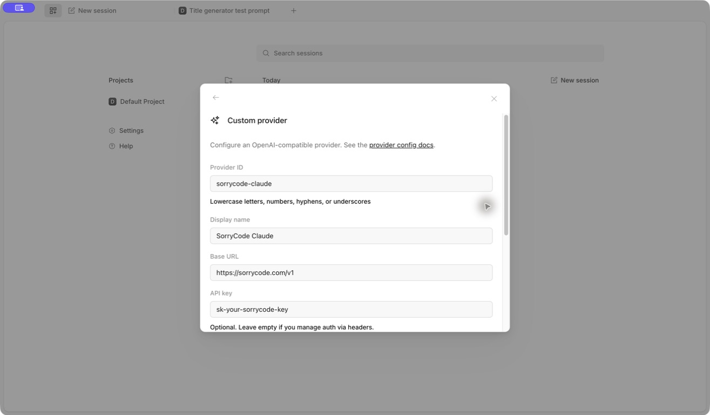
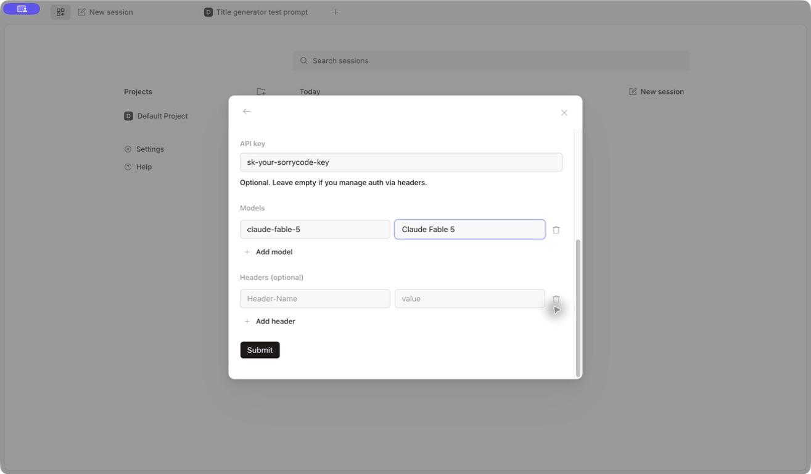

# OpenCode

OpenCode is an open-source, multi-model agent. For the first SorryCode setup, use the visual provider form in the Desktop app.

> **Let Your Agent Configure It**
>
> Click `Copy Markdown` in the upper-right and send the content to the agent you are using. Ask it to complete the configuration and verification steps it can safely perform, then list anything that still needs your confirmation. If the agent can read web pages, you can send this page URL instead. Do not paste your API key into the conversation.

<h2 id="install">1. Install OpenCode Desktop</h2>

Install the app for your system from the [official OpenCode download page](https://opencode.ai/download). Then open:

```text
Settings -> Providers -> Custom Provider -> Connect
```

<h2 id="prepare-key">2. Prepare a Key for the Model Group</h2>

Choose a key on the [SorryCode API Key page](https://sorrycode.com/keys). Its group must expose the model you plan to add.

One provider uses one key. If Claude, GPT, and DeepSeek require different groups, create a separate provider for each instead of putting all three models under one provider.

<h2 id="fill-provider">3. Fill In the Provider</h2>

| Field | Value |
| --- | --- |
| Provider ID | A unique lowercase name, such as `sorrycode-claude` |
| Display name | A recognizable name, such as `SorryCode Claude` |
| Base URL | `https://sorrycode.com/v1` |
| API key | The SorryCode key for this model group |
| Headers | Leave blank |



Use these three setups as examples:

| Model | Provider ID | Model ID | Display name | Key to use |
| --- | --- | --- | --- | --- |
| Claude | `sorrycode-claude` | `claude-fable-5` | `Claude Fable 5` | A group key that exposes this Claude model |
| GPT | `sorrycode-gpt` | `gpt-5.6-sol` | `GPT-5.6 Sol` | A group key that exposes this GPT model |
| DeepSeek | `sorrycode-deepseek` | `deepseek-v4-flash` | `DeepSeek V4 Flash` | A group key that exposes this DeepSeek model |



Click `Add Model` when one key group exposes more than one model. If an example ID is not available to the current group, use the exact model ID listed by the configuration under `Connect Tool -> OpenCode` on the API Key page.

Click `Submit` when the form is complete.

<h2 id="verify">4. Select the Model and Verify It</h2>

Start a new session. Use the model selector beside the prompt box to choose the provider and model you just added, then send:

```text
Reply with exactly OPENCODE_SORRYCODE_OK. Do not modify files.
```

The connection is ready when the reply is `OPENCODE_SORRYCODE_OK`. This flow has been verified with a SorryCode Claude-group key.

<h2 id="common-issues">Common Issues</h2>

- `401`: the key is invalid or its group does not match this provider
- `404` or model not found: the model ID is not available to this key group
- The model appears but requests fail: check whether a model from another group was added to this provider
- The provider ID already exists: use a unique ID instead of replacing the existing key

For the terminal-only version, copy the generated configuration from `Connect Tool -> OpenCode` on the API Key page. See [OpenCode configuration](https://opencode.ai/docs/config/) for file locations and merge rules.
