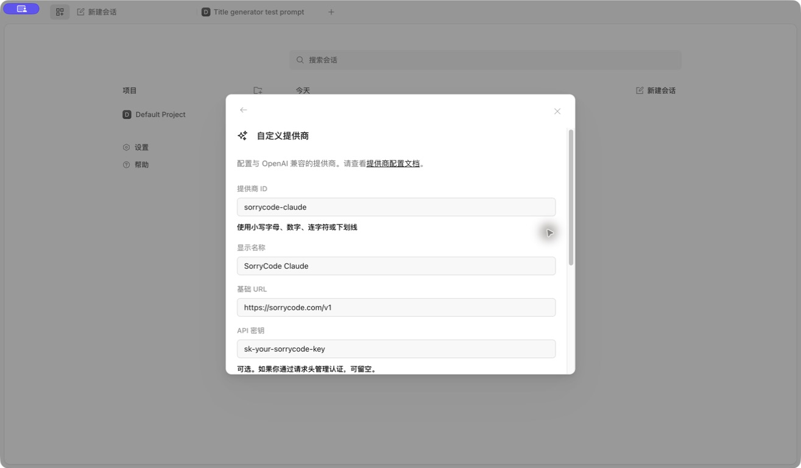
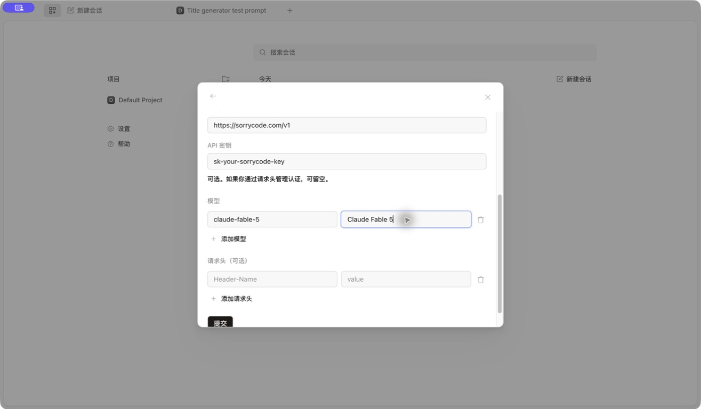

# OpenCode

OpenCode 是开源的多模型 Agent。第一次接入 SorryCode，直接使用 Desktop 客户端的可视化配置即可。

> **交给 Agent 配置**
>
> 点击右上角的「复制 Markdown」，把内容发给你正在使用的 Agent。让它根据当前环境完成可以自动执行的配置和验证，并列出需要你手动确认的步骤。Agent 能读取网页时，也可以直接发送本页链接。不要在对话中粘贴 API Key。

<h2 id="install">1. 安装 OpenCode Desktop</h2>

从 [OpenCode 官方下载页](https://opencode.ai/download) 安装适合当前系统的客户端。打开后进入：

```text
设置 -> 提供商 -> 自定义提供商 -> 连接
```

<h2 id="prepare-key">2. 准备匹配分组的 Key</h2>

在 [SorryCode API Key 页面](https://sorrycode.com/keys) 选择一把 Key。它所属的分组必须开放你准备添加的模型。

一个提供商配置只绑定一把 Key。Claude、GPT 和 DeepSeek 属于不同分组时，要分别创建提供商，不能把三种模型都填在同一个提供商下。

<h2 id="fill-provider">3. 填写提供商</h2>

| 字段 | 填写内容 |
| --- | --- |
| 提供商 ID | 唯一的小写名称，例如 `sorrycode-claude` |
| 显示名称 | 方便识别的名称，例如 `SorryCode Claude` |
| 基础 URL | `https://sorrycode.com/v1` |
| API 密钥 | 当前模型分组对应的 SorryCode Key |
| 请求头 | 留空 |



模型可以先按下面三组示例填写：

| 模型 | 提供商 ID | 模型 ID | 显示名称 | 使用的 Key |
| --- | --- | --- | --- | --- |
| Claude | `sorrycode-claude` | `claude-fable-5` | `Claude Fable 5` | 支持该 Claude 模型的分组 Key |
| GPT | `sorrycode-gpt` | `gpt-5.6-sol` | `GPT-5.6 Sol` | 支持该 GPT 模型的分组 Key |
| DeepSeek | `sorrycode-deepseek` | `deepseek-v4-flash` | `DeepSeek V4 Flash` | 支持该 DeepSeek 模型的分组 Key |



同一把 Key 的分组开放多个模型时，可以点击 `添加模型`。如果示例 ID 不在当前分组中，以 API Key 页 `接入工具 -> OpenCode` 生成配置里列出的准确模型 ID 为准。

填完后点击 `提交`。

<h2 id="verify">4. 选择模型并验证</h2>

新建会话，在输入框旁的模型选择器中找到刚才添加的提供商和模型，然后发送：

```text
Reply with exactly OPENCODE_SORRYCODE_OK. Do not modify files.
```

返回 `OPENCODE_SORRYCODE_OK` 即表示连接成功。本流程已使用 SorryCode Claude 分组 Key 完成实际验证。

<h2 id="common-issues">常见问题</h2>

- `401`：Key 无效，或 Key 所属分组与当前提供商不匹配
- `404` 或 model not found：模型 ID 不在当前 Key 的分组中
- 模型能看到但请求失败：检查是否把其他分组的模型填进了当前提供商
- 已有同名提供商：换一个唯一的提供商 ID，不要覆盖旧 Key

只使用终端版时，可以从 API Key 页的 `接入工具 -> OpenCode` 复制生成配置。配置文件路径和合并规则见 [OpenCode 配置文档](https://opencode.ai/docs/config/)。
