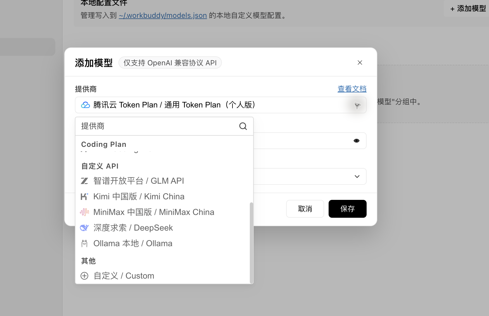

# Connect WorkBuddy to SorryCode

WorkBuddy supports custom OpenAI-compatible APIs. You do not need an environment variable or a manual `models.json` edit. Use the WorkBuddy model settings to enter the SorryCode endpoint, a dedicated API key, and an exact model ID.

This guide matches the WorkBuddy `5.3.5` interface. Labels may move in later releases, but the configuration fields remain the same.

<h2 id="prepare-key">Prepare a Dedicated API Key</h2>

1. Open <https://sorrycode.com/keys>
2. Create a new API key
3. Select a group that supports the model you intend to use
4. Keep this key separate from keys for Codex, Claude Code, Grok, or Image2

Check which models the key actually exposes:

```bash
curl https://sorrycode.com/v1/models \
  -H "Authorization: Bearer <your WorkBuddy API key>"
```

The `Model Name` field must use an exact `id` returned by this request. Do not guess an API model ID from a marketing name.

<h2 id="open-settings">Open Custom Models</h2>

Click your account name in the lower-left corner of WorkBuddy, then open:

```text
Settings → Models → Add Model
```

At the bottom of the provider list, select:

```text
Custom
```



<h2 id="fields">Enter the SorryCode Configuration</h2>

Use these values:

| Field | Value |
| --- | --- |
| Provider | `Custom` |
| Endpoint | `https://sorrycode.com/v1/chat/completions` |
| API Key | your dedicated SorryCode key for WorkBuddy |
| Model Name | the exact model ID returned by `/v1/models` |
| Tool Calling | enabled |
| Image Input | enable only when the model and key group explicitly support image input |
| Thinking Mode | enable only when the model explicitly supports a reasoning mode |
| Custom Protocol | disabled |
| Input / Output | keep `Use provider default` for the first setup |

WorkBuddy expects the full endpoint here, including `/v1/chat/completions`. Do not enter only `https://sorrycode.com`, and do not use a `/responses` or `/messages` endpoint in this form.

`Tool Calling` allows the model to ask WorkBuddy to create files, perform controlled actions, or invoke Skills. Plain chat can work without it, but normal WorkBuddy office tasks depend on it, so keep it enabled by default.

Click `Save`. WorkBuddy writes the model to `~/.workbuddy/models.json` and adds it to the `Custom Models` group in the model picker. The graphical interface remains the supported setup path; manual file editing is not the default.

<h2 id="verify">Verify the Connection</h2>

Close Settings, return to `New Task`, and select the saved custom model.

Test a plain response first:

```text
Reply with exactly: workbuddy-sorrycode-ok
```

Then select an empty test folder as the workspace and verify tool calling:

```text
Create connection-test.md in the current workspace. Write one line: WorkBuddy completed a tool call through SorryCode. Do not modify any other files. Tell me the saved path when finished.
```

The basic path is complete only when the text response succeeds and `connection-test.md` exists. If the first test succeeds but the file is missing, the model connection works but tool calling does not.

<h2 id="security">Where the Key Is Stored</h2>

WorkBuddy stores custom model settings locally:

```text
~/.workbuddy/models.json
```

This file may contain a plaintext API key:

- do not commit it to Git
- do not upload it to cloud drives or group chats
- hide the entire API key field in screenshots
- when the model is no longer needed, remove it in WorkBuddy and delete or rotate the matching key in the SorryCode console

<h2 id="common-issues">Common Issues</h2>

### `401` or invalid API key

Copy the dedicated WorkBuddy key again, check for spaces, and make sure the key has not been deleted or disabled.

### `404` or model not found

Confirm the complete endpoint:

```text
https://sorrycode.com/v1/chat/completions
```

Query `/v1/models` again and use an exact returned ID as the model name.

### Chat works, but WorkBuddy cannot create files

Make sure `Tool Calling` is enabled. If it is already enabled, choose a model with explicit OpenAI-compatible tool-call support and retry inside an empty workspace.

### Images are not understood

Enable `Image Input` only when the model, key group, and WorkBuddy configuration all support it. A checkbox cannot add vision capability to a text-only model.

### `429`, insufficient balance, or too many requests

Check the SorryCode balance, key group, and spending limits. A complex office task can make several model calls, so one chat response is not a full-task cost estimate.

For shared gateway errors, see [Troubleshooting / Common Errors](/docs/troubleshoot/common-errors). Upstream reference: [WorkBuddy model configuration](https://www.codebuddy.cn/docs/workbuddy/From-Beginner-to-Expert-Guide/Function-Description/Model).
