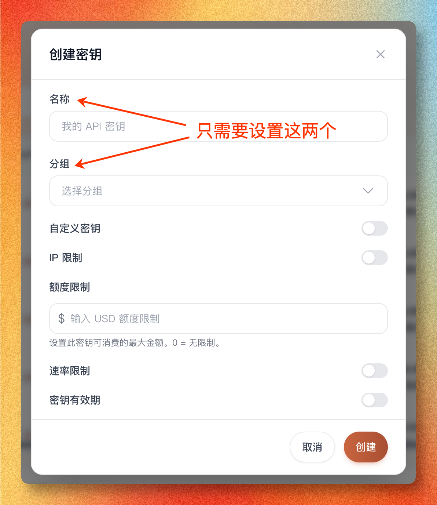

# Create API Key

An `API` is the channel tools use to talk to models.

When you chat with AI in a browser, you type into a web page. Tools like `Codex`, `Claude Code`, and `Skills` do not click web pages like humans do. They need a software-to-software way to request a model. That way is called an API.

An `API Key` is the key on that channel. It proves that this is your SorryCode account using the model. It usually starts with `sk-...`.

No matter whether you use Codex, Claude Code, Grok, an image skill, or manual setup, this step is unavoidable. The console can now generate one-click install commands from this key, so create the key first.

One SorryCode balance can have multiple API keys. As a beginner, do not force every tool to share the same key.

Match each key to one purpose and one group. A practical setup is:

| Key name | Selected group | Used for |
| --- | --- | --- |
| `Codex` | A group that supports Codex / OpenAI-compatible traffic | Codex |
| `Claude Code` | A group that supports Anthropic-compatible traffic | Claude Code |
| `Grok` | A Grok group | Grok CLI, Grok images, and Grok video |
| `Image2` | An image group that supports `gpt-image-2` | GPT Image 2 API and the SorryCode Image2 Skill |

This does not split your balance. The balance is still shared. Separate keys make usage records, group switching, spending limits, and troubleshooting much clearer.

## The Shortest Path

1. Open `https://sorrycode.com/login` and sign in to the SorryCode console
2. Find `API Keys` in the left menu
3. Create a new key
4. Name it by use, such as `Codex`, `Claude Code`, `Grok`, or `Image2`
5. Select a group
6. Copy the key and store it safely

What you should end up with is an `sk-...`.

The quick link is:

`https://sorrycode.com/keys`

But do not rely on the URL alone. A first-time user usually needs to know where this page sits inside the console.


## What to Fill In

The name is only for you. Use the tool or purpose:

```text
Codex
Claude Code
Grok
Image2
Test Request
```

The group decides which model group and billing multiplier this key uses. You can switch the group later from the API key list.

The spending limit controls the maximum balance this key can consume. `0` means no separate limit. Beginners can leave it alone first, then add limits after regular usage starts.

The rate limit controls request frequency. It is not the model multiplier. If you are just using Codex or Claude Code normally, you usually do not need to enable it first.

The key expiration is useful for temporary test keys. Long-term Codex / Claude Code keys usually do not need an expiration date at the start.



## What You Actually Need to Remember

As a beginner, remember three lines:

- `API` is the channel
- `API Key` is the key
- `SorryCode` is where you create the key, manage balance, and connect tools to models

Then remember one more line:

```text
one balance can have multiple API keys.
```

You can create separate keys for separate tools. For example: one for Codex, one for Claude Code, one for Grok, and one for Image2. They use the same balance, but management and troubleshooting become much clearer.

Do not treat every `sk-...` value as interchangeable. Keep the Grok key assigned to a Grok group. Keep the Image2 key assigned to an image group that supports `gpt-image-2`. A mismatched group can cause access errors, unavailable models, or incorrect routing.

If you use one-click install, the installer writes most config for you. You usually do not need to understand `Base URL` first.

Only continue with the values below when you are configuring manually:

- API Key: the `sk-...` value you just created
- which Base URL your target workbench needs

If you use `Codex` and other OpenAI-compatible paths, the Base URL is:

- `{{API_BASE_URL}}`

If you use `Claude Code` and other Anthropic-compatible paths, the Base URL is:

- `{{ANTHROPIC_BASE_URL}}`

Some runtime field names can look misleading.

For example, `Claude Code` calls the field `ANTHROPIC_AUTH_TOKEN`, but the value inside it is still the same `sk-...`.

## How to Use It After Creation

After creation, the console shows the full key. Copy the `sk-...` value.


If you use the Codex, Claude Code, or Grok one-click installer, you usually do not need to copy the raw key by hand.

The easier path is to return to the API key list, find this key, and click `Connect Tool`:


1. choose the tool that matches this key, such as `Codex`, `Claude Code`, or `Grok`
2. choose your operating system
3. copy the full command from the modal
4. open the terminal on your own computer
5. paste the command and press Enter

That command already includes the current API key. Copy the raw `sk-...` value yourself only for manual setup or troubleshooting.

If you already created a key, the API key list lets you:

- copy the key
- connect a tool
- rename it
- switch its group
- set a spending limit
- disable or delete keys you no longer use

Do not force every tool into one key. Separate keys make later usage records much easier to understand. `SorryCode Image2` does not use this one-click installer entry. Its Skill page explains how to store the Image2 key.


## Security Rules

- do not commit it into a repo
- do not paste it into public chats
- do not put it directly into long-lived shell history
- commands copied from `Connect Tool` include the current key, so do not run them on shared computers, recorded screens, or public terminals
- revoke and recreate it immediately if it leaks

## Next

- Unsure whether SorryCode fits you: [Getting Started / Who SorryCode Is For](/docs/start/who-is-sorrycode-for)
- Want to understand AI cost: [Getting Started / How AI Cost Works](/docs/start/ai-cost-basics)
- Want to start with Codex: [Runtime / Codex](/docs/runtime/codex)
- Want to start with Claude Code: [Runtime / Claude Code](/docs/runtime/claude-code)
- Unsure how runtimes and models relate: [Getting Started / Tools Are Not Models](/docs/concepts/tools-models-platform)
- Want a minimal validation first: [Getting Started / First Request](/docs/start/first-request)
- Want less terminal work: [Tools / CC-Switch](/docs/tools/cc-switch)
